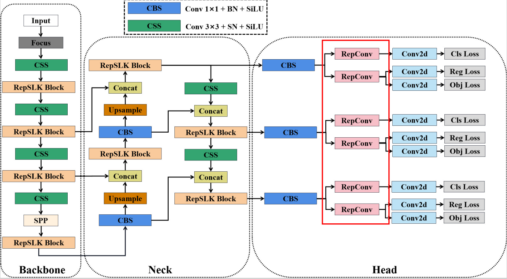
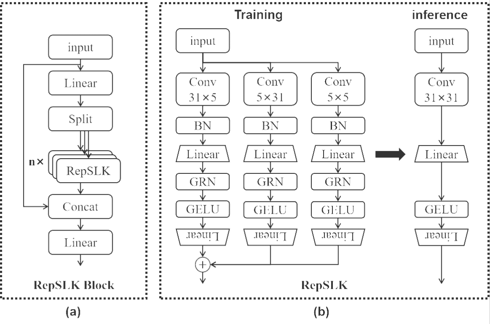

# X-CDNet: A real-time crosswalk detector based on YOLOX

## Authors
- Xingyuan Lu
- Yanbing Xue
- Zhigang Wang
- Haixia Xu
- Xianbin Wen

## Paper
- [Link to the paper](https://doi.org/10.1016/j.jvcir.2024.104206)

## Abstract
As urban traffic safety becomes increasingly important, real-time crosswalk detection is playing a critical role in the transportation field. However, existing crosswalk detection algorithms must be improved in terms of accuracy and speed. This study proposes a real-time crosswalk detector called X-CDNet based on YOLOX. Based on the ConvNeXt basic module, we designed a new basic module called Reparameterizable Sparse Large-Kernel (RepSLK) convolution that can be used to expand the model’s receptive field without the addition of extra inference time. In addition, we created a new crosswalk dataset called CD9K, which is based on realistic driving scenes augmented by techniques such as synthetic rain and fog. The experimental results demonstrate that X-CDNet outperforms YOLOX in terms of both detection accuracy and speed. X-CDNet achieves a 93.3 AP50 and a real-time detection speed of 123 FPS.

### Figure 1

### Figure 2

